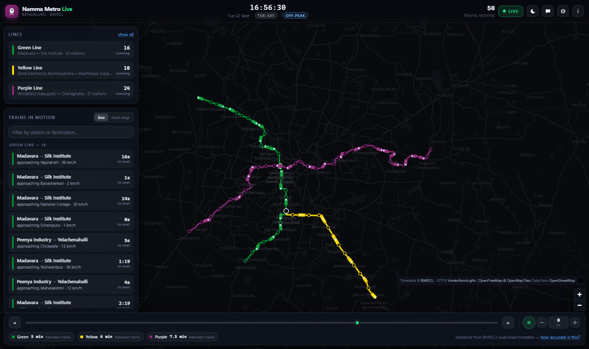
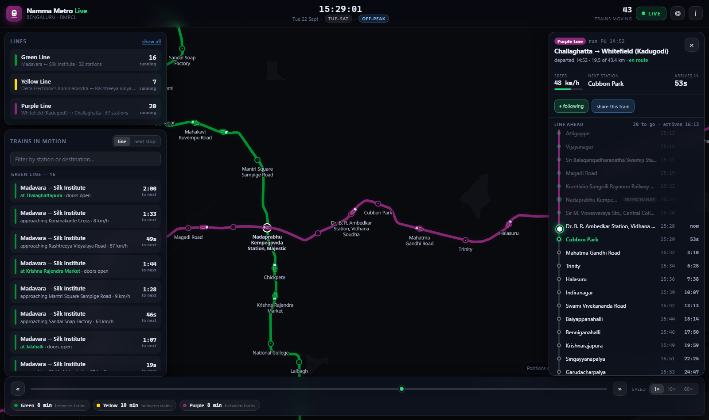
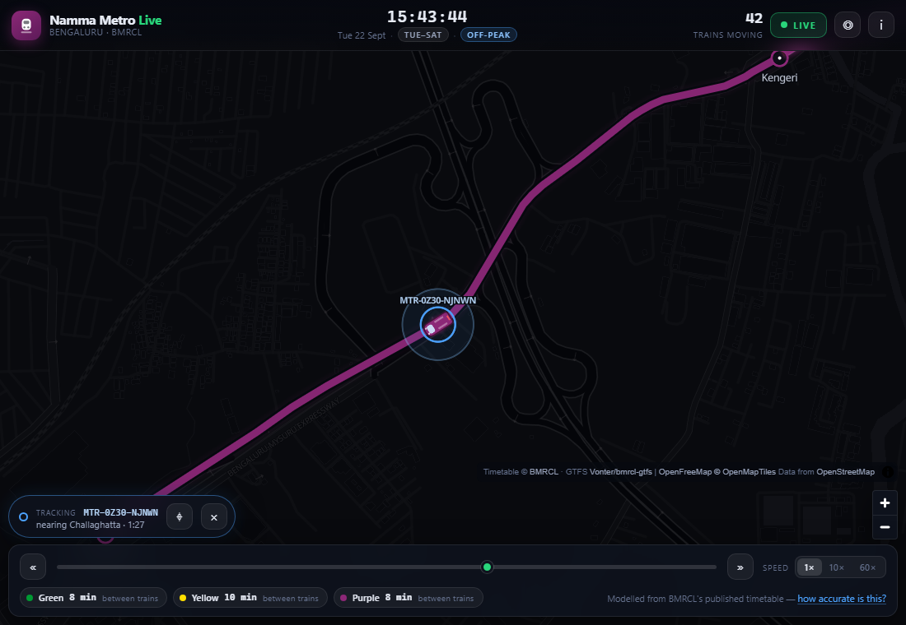
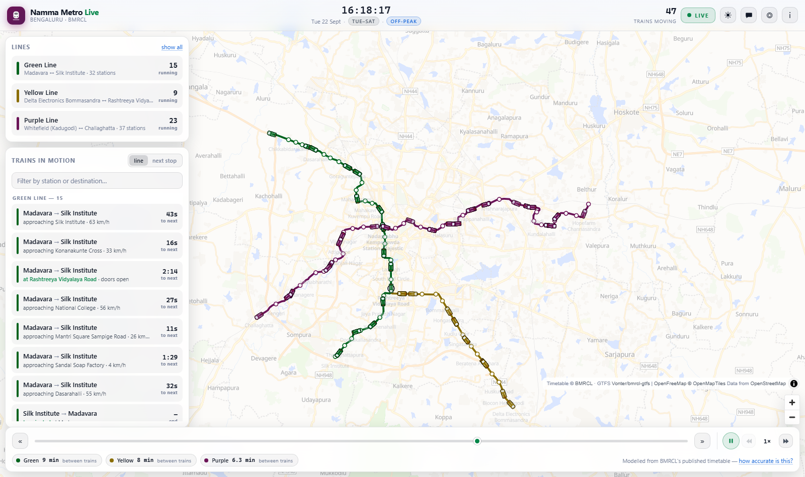
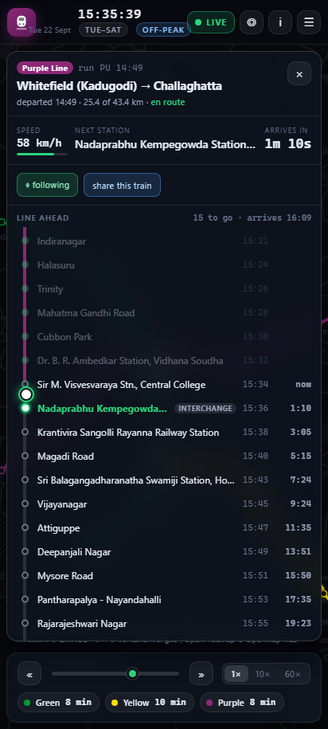
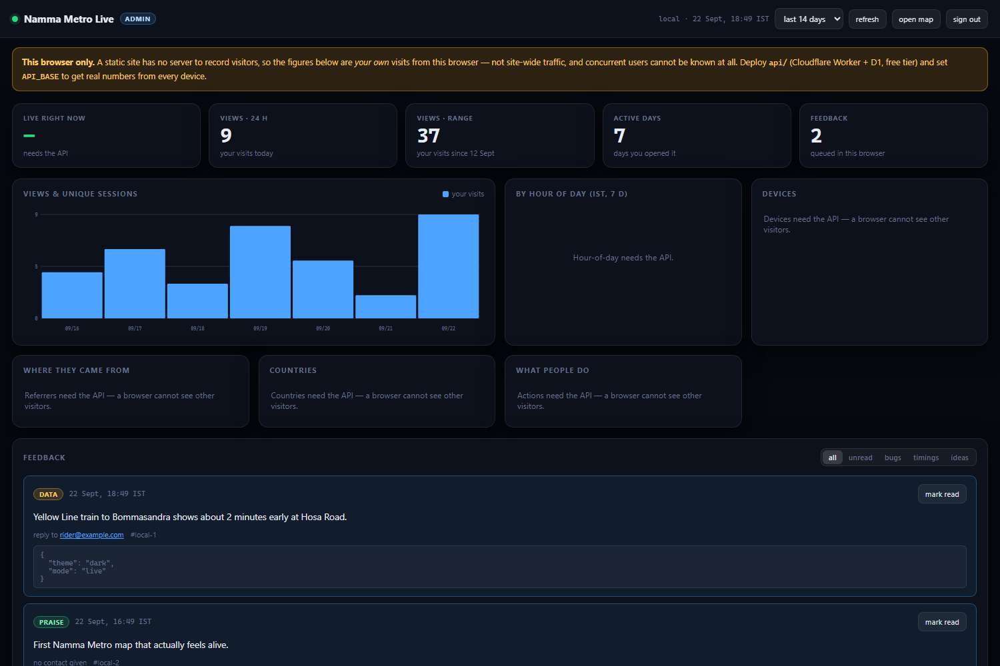

<div align="center">

# Namma Metro Live

**Every Bengaluru metro train, moving on a map, right now.**

A real-clock simulation of the entire Namma Metro network — Purple, Green and Yellow lines —
with per-train speed, next-stop countdowns, live station departure boards, and shareable
codes so you can watch a friend's train.

No build step · no npm dependencies · no backend required · no API keys

[Quick start](#quick-start) · [How "live" works](#how-live-works-honestly) · [Architecture](#architecture) · [Data](#where-the-data-comes-from) · [Deploy](#deploy-it-free) · [Tests](#tests)



</div>

---

## Why this exists

Namma Metro has no public real-time feed. If you want to know where the trains actually are,
your options are the station display or guessing. This project takes the timetable BMRCL
does publish, runs it against the real Bengaluru clock, and draws the result on the actual
track alignment — so what you see is *where the trains are supposed to be this second*,
not a generic animation.

It is also a demonstration that a genuinely rich, interactive, data-heavy web app does not
need a framework, a bundler, or a node_modules folder.

| | |
|---|---|
| **Live fleet** | 40–65 trains in motion at peak, interpolated along real OpenStreetMap track geometry at 60 fps |
| **Tap a train** | speed, distance covered, next stop, and a strip map of every remaining station with the train sliding down it live |
| **Tap a station** | the next ~16 arrivals split by direction, counting down |
| **Share a train** | a code like `MTR-4K7P-2XQ8`, or a link — the recipient sees that train ringed and labelled while the rest of the fleet fades back |
| **Peak / off-peak** | current headway per line, plus a frequency-by-time-of-day table derived from the timetable itself |
| **Time travel** | play / pause, slow motion to 0.25×, fast-forward to 32×, or any custom rate up to 240× — displayed as a signed notch (`−2` … `0` … `+6`) beside the multiplier |
| **Light & dark** | full theme swap including the basemap; line colours darken so the Yellow Line stays legible on a pale map |
| **Feedback** | in-app form, stored server-side and optionally emailed, readable from a private dashboard |

<table>
<tr>
<td width="50%"><br><em>Tap a train: speed, ETA, and a live strip map</em></td>
<td width="50%"><br><em>Tracking a friend's train — the rest of the fleet fades</em></td>
</tr>
<tr>
<td><br><em>Light theme on the standard basemap</em></td>
<td><br><em>Phone layout</em></td>
</tr>
</table>

---

## Quick start

Needs **Node 20+**. There is nothing to install — no `npm install`, no lockfile, no bundler.

```bash
git clone <your-fork-url> && cd mymetrotracker
node tools/serve.mjs          # → http://localhost:5173
```

That's it. `public/` is already a deployable site.

---

## How "live" works, honestly

**BMRCL publishes no public real-time feed.** There is no GTFS-Realtime endpoint for Namma
Metro, so no website — including this one — can show true GPS positions of these trains.
Anything claiming otherwise is either guessing or lying.

What this does instead:

1. **Resolves today's service pattern.** BMRCL operates four distinct timetables:
   `weekday` (Tue–Sat), `monday`, `sunday`, and `holiday`. Public holidays are resolved
   from the GTFS calendar exceptions, so Gandhi Jayanti runs the holiday timetable
   automatically.
2. **Advances it with the real Asia/Kolkata clock**, second by second. Open the site from
   London and you still see the trains running in Bengaluru now — the timezone is resolved
   with `Intl.DateTimeFormat`, never from the visitor's machine.
3. **Interpolates each train between its scheduled calls** along the real track polyline
   from OpenStreetMap, using an accelerate–cruise–brake velocity profile rather than a
   linear tween. A linear ramp reads as obviously fake; real trains leave a platform slowly
   and coast into the next one.
4. **Includes the short-loop turnback services** — Baiyappanahalli, Garudacharpalya,
   Peenya Industry, Yelachenahalli, MG Road. 13 of the 19 stopping patterns are short loops,
   and leaving them out would show a network that runs more sparsely than it does.
5. **Keeps tracking trains past midnight.** A run that departed at 23:55 is still out on the
   line at 00:20, so the engine evaluates both today's and yesterday's service day.

### Known limits

- **Intermediate station times are modelled.** BMRCL publishes terminal times only. Times
  between termini are derived from stop spacing, dwell time and average speed. Expect a
  minute or two of drift against the train in front of you.
- **Delays cannot be detected.** During a disruption the map is confidently wrong.
- **Don't use it to catch your last train.**

The schedule layer is isolated behind the `Simulation` class. If BMRCL ever opens a
GTFS-Realtime feed, it can be substituted without touching the map or the UI.

---

## Where the data comes from

| What | Source | Notes |
|---|---|---|
| Timetables, stations, fares | **BMRCL**, via the unofficial [`Vonter/bmrcl-gtfs`](https://github.com/Vonter/bmrcl-gtfs) dataset | Feed version `20260817`, valid to Aug 2027 |
| Track geometry, coordinates | [OpenStreetMap](https://www.openstreetmap.org/copyright) contributors (ODbL) | Real viaduct and tunnel curves, not straight hops |
| Basemap tiles | [OpenFreeMap](https://openfreemap.org) | Free, no API key, no signup |
| Map renderer | [MapLibre GL JS](https://maplibre.org) 5.24.0 | Vendored into `public/vendor/`, no runtime CDN |

The build cross-checks against published figures and matches them: **83 stations**,
Purple 37 (Whitefield ↔ Challaghatta, 43.4 km / 80 min), Green 32 (Madavara ↔ Silk
Institute, 33.1 km), Yellow 16 (RV Road ↔ Bommasandra, 18.0 km).

### The compression step

`stop_times.txt` is 5.4 MB — 88,906 rows across 3,279 trips. Shipping that to a browser
would be absurd. `tools/build-data.mjs` notices that thousands of trips share a handful of
distinct *(stopping pattern + relative timings)* signatures and deduplicates them:

```
3,279 trips  ──▶  19 stopping patterns
                  each trip becomes [patternIndex, departureSecond]

5.4 MB stop_times.txt  ──▶  48 KB schedule.json     (112× smaller)
```

Positions come from `shape_dist_traveled`, which GTFS provides in both `stop_times` and
`shapes`. Converting "this train is 12.84 km along the Purple Line" into a coordinate is a
binary search plus one interpolation — which is why the whole fleet costs **0.11 ms per
frame** to simulate and push to the GPU.

### Refreshing the timetable

```bash
node tools/fetch-gtfs.mjs     # download + unzip upstream GTFS (dependency-free ZIP reader)
node tools/build-data.mjs     # regenerate public/data/*.json
node tools/test-sim.mjs       # 82 assertions against the rebuilt data
```

---

## Architecture

```
                         ┌──────────────────────────────────────┐
  BMRCL timetables ──┐   │  BUILD TIME  (node, no deps)         │
  OpenStreetMap    ──┼──▶│  fetch-gtfs.mjs → build-data.mjs     │
                         │  5.4 MB GTFS  →  179 KB JSON         │
                         └──────────────┬───────────────────────┘
                                        │  committed artefacts
                                        â–¼
  ┌──────────────────────────────────────────────────────────────────────┐
  │  BROWSER  (ES modules, no bundler)                                   │
  │                                                                      │
  │   clock.js      IST wall clock + GTFS calendar → today's service_id   │
  │       │                                                              │
  │       ▼                                                              │
  │   simulation.js ── the engine ───────────────────────────────────┐   │
  │       │  trainsAt(t)      active trips via binary search          │   │
  │       │  resolve()        trapezoidal accel/cruise/brake profile  │   │
  │       │  boardFor()       station departure boards                │   │
  │       │  headwayNow()     live headway, peak classification       │   │
  │       └──────────────┬───────────────────────────────────────────┘   │
  │                      │  Train[] (lon, lat, bearing, speed, ETA…)     │
  │         ┌────────────┴────────────┐                                  │
  │         ▼                         ▼                                  │
  │   geometry.js              map-view.js          ui.js                │
  │   km → lon/lat             MapLibre scene       panels, strip map,    │
  │   + stable bearing         1 GeoJSON source     boards, share dialog  │
  │                            rewritten per frame  keyed DOM diffing     │
  │                                                                      │
  │   theme.js  sharecode.js  analytics.js  feedback.js  config.js        │
  └───────────────────────────────┬──────────────────────────────────────┘
                                  │  optional, only for feedback + stats
                                  â–¼
  ┌──────────────────────────────────────────────────────────────────────┐
  │  CLOUDFLARE WORKER + D1   (api/)                                     │
  │   POST /api/event      anonymous view / ping / action beacons        │
  │   POST /api/feedback    → D1, optional Resend email forward          │
  │   POST /api/admin/login PBKDF2 verify → 12 h HMAC session token      │
  │   GET  /api/admin/stats traffic, surges, referrers, countries        │
  └──────────────────────────────────────────────────────────────────────┘
```

### Design decisions worth explaining

**Why no framework.** The hot path is "move 60 symbols, 60 times a second." A virtual DOM is
the wrong tool: MapLibre already owns the pixels, and the panels only need updating four
times a second. `ui.js` uses a 20-line keyed reconciler so a row you are hovering doesn't
flicker while its countdown ticks. Total client JS: ~90 KB unminified, including the app,
the simulation engine and every panel.

**Why the real clock, not an accumulator.** In live mode the time source is
`istNow()` every frame, not `t += dt`. Background the tab for ten minutes and on return the
trains are exactly where they should be, with no catch-up animation and no drift. Simulated
mode switches to an accumulator, which is what makes 4× playback possible.

**Why one GeoJSON source instead of markers.** 60 DOM markers means 60 elements being
transformed per frame and a layout cost that scales with the fleet. One `setData()` call
re-uploads a single small buffer and lets the GPU do the work.

**Why the vendored UMD MapLibre build.** MapLibre v6 ships as three ESM chunks plus a
module worker, which is fragile to host statically. The v5 UMD bundle is one self-contained
file with its worker inlined as a blob — so there is no runtime CDN dependency, no
integrity to verify at load, and the site keeps working if unpkg is down.

**Why the strip map moves every frame but the text doesn't.** The marker position is a
single `style.top` write per frame (cheap, and it's the thing that reads as "live"). Station
countdowns re-render four times a second, which is imperceptibly different from 60 and a
fraction of the cost.

### File map

```
public/                  ← the deployable site; everything below is optional tooling
  index.html  app.css
  admin.html  admin.css
  js/
    main.js              bootstrap + rAF loop, real-clock time source
    simulation.js        timetable → live positions, headways, peak analysis
    geometry.js          along-track distance → lon/lat + stable bearing
    clock.js             IST handling, GTFS calendar resolution
    map-view.js          MapLibre scene; rebuildable for theme swaps
    ui.js                panels, strip map, boards, playback, share, feedback
    theme.js             dark/light tokens + per-theme map palette
    sharecode.js         Crockford base32 run codes with a check character
    analytics.js         anonymous beacons (no-op without an API)
    feedback.js          submit + offline queue + mailto fallback
    admin.js             dashboard; hand-rolled SVG charts
    config.js            ← the one file you edit after deploying the API
  data/                  built artefacts, committed (the site needs them)
  vendor/                MapLibre GL JS
api/                     optional Cloudflare Worker + D1 schema
tools/
  fetch-gtfs.mjs         download + unzip upstream feed (no dependencies)
  build-data.mjs         GTFS → compact JSON
  verify.mjs             data integrity report
  test-sim.mjs           82 engine assertions
  test-api.mjs           51 Worker auth / routing assertions
  browser-check.mjs      160 end-to-end assertions in real Chrome over CDP
  screenshot.mjs         capture the running app
  hash-password.mjs      derive the admin secret
  serve.mjs              static dev server
```

---

## Sharing a train

Select the train you're on, press **share this train**, and you get a code:

```
MTR-4K7P-2XQ8
```

Read it out, message it, or send the link (`?train=MTR4K7P2XQ8`). Whoever enters it sees
that exact train ringed and labelled while every other train fades to 22% opacity.

The code packs three things into 38 bits — the service day, the stopping pattern, and the
second the run left its origin — rendered in **Crockford base32** (no `I`, `L`, `O` or `U`,
so `1`/`I` and `0`/`O` can't be confused) with a positional check character. **96% of
single-character typos are rejected** rather than silently pointing at the wrong train.
Decoding accepts any case and any punctuation.

Nothing is uploaded. The code is self-contained: no account, no server, no record of who
shared what.

---

## Admin dashboard

`/admin.html` — live sessions, views, traffic surges, referrers, countries, devices, and
every piece of feedback received.



### An honest note on security

A static site **cannot** authenticate anyone. Any password in client-side JavaScript is
readable by anyone who opens devtools, and a static site has no server to count visitors
with. So:

- **With the API deployed** (the real mode): the password is never in this repository or in
  any file the browser downloads. It exists only as a PBKDF2-SHA256 derivation in a
  Cloudflare secret. Login is verified by the Worker, rate limited to 6 attempts per 15
  minutes, compared in constant time, and returns a 12-hour HMAC-signed token — held in
  `sessionStorage`, not a cookie, so there is no CSRF surface.
- **Without the API** (`API_BASE === ''`): `/admin.html` runs in **local mode**. The gate
  checks your username against a SHA-256 digest in `config.js` so it behaves as you'd
  expect, but the page says plainly that this is **cosmetic, not security**. That is
  acceptable only because local mode has nothing to protect: it leaves every traffic tile
  blank rather than inventing numbers, and shows only feedback queued in *that visitor's
  own* browser.

`tools/browser-check.mjs` greps the whole client bundle on every run and asserts that the
plaintext password, the PBKDF2 secret shape, and any long key literal are all absent.

### Privacy

No cookies. No fingerprinting. No third-party scripts. No IP addresses stored — Cloudflare
provides a two-letter country at the edge and that is the only location signal retained.
Session ids are random, live in `sessionStorage`, and die with the tab. `DNT` and
`Sec-GPC` are honoured without asking.

---

## Deploy it free

The publish directory is **`public/`**. The site works fully without the API.

**Netlify** — drag `public/` onto [app.netlify.com/drop](https://app.netlify.com/drop).
For a persistent site, connect the repo; `netlify.toml` already sets the publish directory
and cache headers.

**Vercel**
```bash
npx vercel --prod         # output directory: public
```

**Cloudflare Pages** — build command: none · output directory: `public`

**GitHub Pages** — push to `main`. `.github/workflows/deploy.yml` runs the engine and API
test suites, then publishes `public/`. Enable it once under
*Settings → Pages → Source: GitHub Actions*.

### Optional: the API (for feedback + stats)

```bash
cd api
npx wrangler login
npx wrangler d1 create namma-metro            # paste the id into wrangler.toml
npx wrangler d1 execute namma-metro --remote --file=./schema.sql

node ../tools/hash-password.mjs               # prints ADMIN_PW + SESSION_SECRET
npx wrangler secret put ADMIN_USER
npx wrangler secret put ADMIN_PW
npx wrangler secret put SESSION_SECRET

npx wrangler deploy
```

Then set `API_BASE` in `public/js/config.js` to the Worker URL and redeploy the site.
Email forwarding is optional — add `RESEND_API_KEY`, `MAIL_FROM` and `MAIL_TO` secrets.

Tighten `ALLOWED_ORIGINS` in `wrangler.toml` to your site's origin once you know it.

---

## Tests

293 assertions, no test framework, nothing to install.

```bash
node tools/test-sim.mjs        #  82  engine: geometry, continuity, boards, share codes
node tools/test-api.mjs        #  51  Worker: PBKDF2, tokens, routing, input clamping
node tools/browser-check.mjs   # 160  end-to-end in real headless Chrome
node tools/verify.mjs          #      data integrity report
```

`browser-check.mjs` drives Chrome over the DevTools Protocol using Node's **built-in**
WebSocket — no Playwright, no Puppeteer, no download. It asserts that trains actually
advance along their lines, that the strip-map marker slides forward, that share codes
round-trip through the real UI, that deep links start tracking, that the theme swap rebuilds
every map layer and darkens the Yellow Line, that no overlay is visible when it should be
hidden, that no element overflows its container, that no two pieces of fixed chrome overlap,
that the admin password is absent from the client bundle, and that the console is clean.

Things the browser suite has caught that unit tests could not:

- `.modal { display: grid }` silently overriding the `hidden` attribute, so two dialogs
  rendered on top of the map at load
- inline `<span>`s not stacking, so sidebar rows spilled onto the map
- a `text-font` stack OpenFreeMap doesn't host, 404-ing every glyph range
- MapLibre's zoom buttons and the OSM attribution buried under the time bar

Sample engine output:

```
PASS  traced length matches shape_dist_traveled   traced 33.10 km vs 33.11 km
PASS  stop distances place trains at their stations   worst 70 m at RV Road
PASS  a train never moves backwards along the line
PASS  peak speed is physically plausible   76 km/h
PASS  over 90% of single-character typos are rejected   96.1% caught
PASS  a full fleet resolves fast enough for 60 fps   0.04 ms/frame
```

---

## Keyboard

| Key | Action |
|---|---|
| `Space` | play / pause |
| `←` `→` | jump 5 minutes |
| `+` `−` | faster / slower — steps the ladder 0.25× · 0.5× · 1× · 1.5× · 2× · 4× · 8× · 16× · 32× |
| `0` | back to real time |
| `X` | custom speed box |
| `L` | back to live |
| `T` | toggle theme |
| `S` | share & track |
| `F` | send feedback |
| `R` | reset view |
| `Esc` | close panels |

---

## Contributing

Spotted a wrong timing? The in-app feedback button sends it straight to me, or open an issue.
Bug reports with the run code from the share dialog are especially useful — they pin down
exactly which train you were looking at.

## License

Code: **MIT**. The underlying transit data keeps its own licence — BMRCL timetables and
OpenStreetMap geometry (ODbL). Not affiliated with or endorsed by BMRCL.
